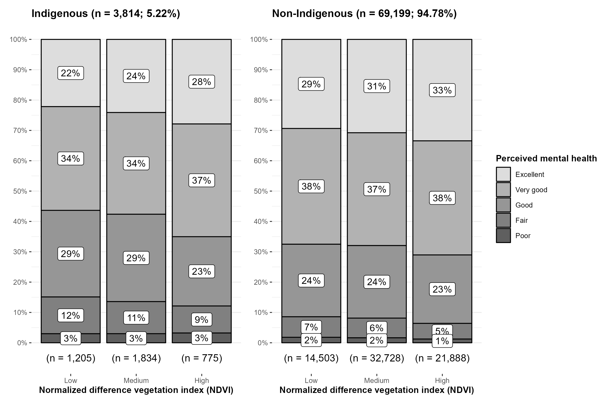

# Methods

## Data Collection

Statistics Canada (StatCan) is a national agency aimed at providing primarily Canadian datasets (Canada, 2023). From their catalogue, we used two databases that contained the relevant metrics:

- The *Canadian Community Health Survey* (CCHS) (reference) notably assesses whether the participant is Indigenous, each participant's self-perceived mental health over an ordinal scale of 1-5 and the health region in which they are located. The collection period of CCHS from January 2 to December 24 of the year 2018 was selected for this cross sectional study to avoid the cohort of confounding variables introduced by Covid-19 (reference). 

- Data on NDVI, a continuous greenery scale of geographical spaces acquired from the *Corrected representation of the NDVI using historical MODIS satellite images (250 m resolution) from 2000 to 2022*, was associated to each participant of the previous dataset using their health region's NDVI value in 2018. Greenery of each of the 77 health regions were determined by averaging the NDVI of the cities found within. For smaller counties which contained only one city, the NDVI thereof was used (_I think it's best to only mention what health regions represent, no need to explain the averaging). The continuous values of the NDVI scale were categorized into three groups of low, medium and high greenery using equal width binning for ease of testing (_give values of ndvi intervals used for precision).

After the combination of the aforementioned datasets, there are a total of n=72,933 effective participants of all age groups spread across all provinces and territories except for Nova Scotia, Yukon, Nunavut and Northwest Territories due to missing data from either survey. For the upcoming tests, three categorical variables are relevantfigure 1, the demography of the participants (Indigenous or Non-Indigenous), the NDVI of their respective regions, and their mental health. Each of the valid and unique participants have their corresponding levels of these three metrics.

## Statistical Tests

The Chi-square test of independence was deemed the most appropriate given the three categorical variables and the goal to prove their correlation. Consequently, three different Chi-square tests were chosen to assess the interaction between demography and mental health (DM), between greenery and mental health (GM) and between all three variables (DGM), (_"using a 3-way contingency table?"). Before the tests could be executed, the following conditions had to be met: 

- The assumption of categorical variables is met as all three variables are as such. Demography is a boolean; the participants are either Indigenous or Non-Indigenous. Greenery is an ordinal variable; the groups of low, medium, and high greenery are used. Similarly, mental health is also ordinal; the metric ranges from excellent, very good, good, fair to poor self-perceived mental health (_can be included in footnote in data collection section). Indeed, they are categorical variables fit for use in a Chi-square test.

- Using the previous assumption's argument, the condition that the levels of the variables are mutually exclusive is also fulfilled. Each participant belongs to only one group of each variable; participants cannot be present in multiple groups of each variable. Mutual exclusivity within each metric is thus ensured.

- The assumption that samples may not be reused within a single contingency table is guaranteed by the sampling method. Subjects are selected from the total n=72,933 population at random without replacement. Therefore, a single participant may only be counted once in one cell of each contingency table generated before any Chi-square test. 

- The condition of independent study groups is also satisfied as per the previous explanation. Observations are selected at random regardless of their grouping based on the three variables. As such, participants have an equal chance of being selected; the samples are independent. 

- After the sampling described previously, selected participants are cumulated into contingency tables which contain frequencies1. The requirement that the table must contain counts is therefore met.

- Likewise, at least 80% of the counts within each contingency table are above 5 because of the large enough sample sizes selected for each of three different Chi-square tests 2. This condition is thus realized.

-Because all assumptions of the Chi-square test are achieved, the actual tests will follow (i think the previous assumptions take up a lot of space and take away from the methods below, I think it is worth just talking about them briefly as "the assumption of independence, categorical variables, random sampling and counts in the contingency table being above 5 80% of the time were verified/achieved"). 

- As samples sizes are quite small2 (_in the footnote do you mean random sample or sample size_) that might be less representative of the n=72,933 subjets available in our dataset, each of the DM, GM and DGM tests were executed 250 times3 each on different random samples to get a more complete overview of the database4.

- Statistical significance p-values resulting from the DM, GM and DGM Chi-square tests5 were compiled into three separate distributions. Moreover, pratical significance effect size for the DM and GM tests were computed using Cramér's V method6 and compiled into two distributions. Cramér's V method does not generalize to three variables; therefore, no practical significance distribution was generated for the DGM test. All the distributions are finally displayed into histograms 7 with confidence intervals and mean values computed for each.

_(maybe also add in the methods that you "controlled for age groups" & specify what DM, GM, DGM means because it seems obvious to me but not to others)

## Footnotes
1 Contingency tables generated with with SciPy (version 1.10.1) using the *scipy.stats.contingency.crosstab* method.

2 Standard parameters used to determine sample size.
1. Effect size: 0.3
2. Alpha error probability: 0.05
3. Power: 0.80
4. Degrees of freedom: 
	- 4 for DM test.
	- 8 for GM test.
	- 22 for DGM test.

Sample sizes for each of the tests where determined using GPower (version 3.1.9.7)
- 134 random samples for DM test.
- 195 random samples for GM test.
- 282 random samples for DGM test.

3 250 is chosen for ease of calculation and is adjustable.

4 Dataset sampling was done using Pandas (version 1.5.3) and NumPy (version 1.24.1) on Python (version 3.11).

5 Chi-square tests performed with SciPy (version 1.10.1) using the *scipy.stats.chi2_contingency* method.

6 Cramér's V tests performed with SciPy (version 1.10.1) using the *scipy.stats.contingency.association* method.

7 Histograms generated with R (version 4.2.3) and ggstatsplot (version 0.11.1).

(reference to chi2 test assumptions https://www.ncbi.nlm.nih.gov/pmc/articles/PMC3900058/)
